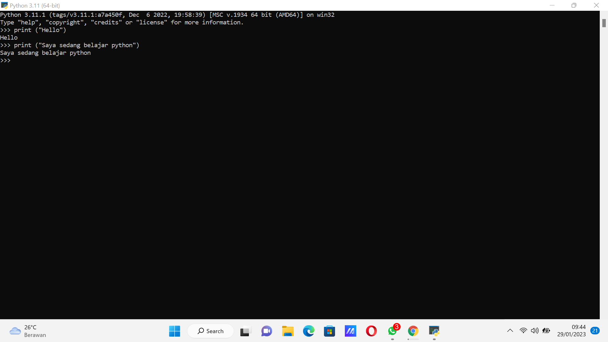
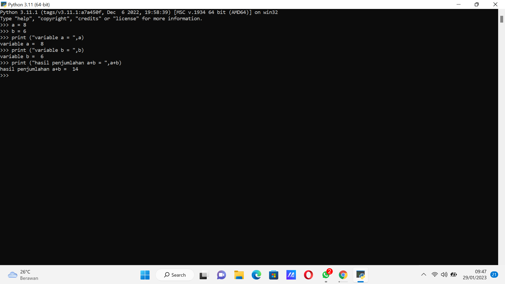
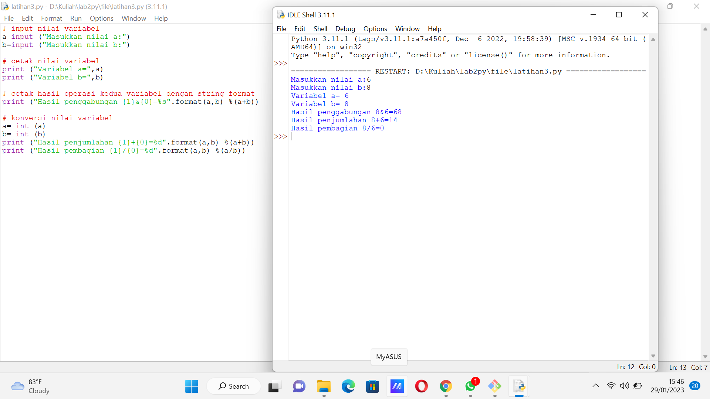

# lab2py
## Tugas bahasa pemrograman
### Langkah-langkah praktikum latihan bahasa python

### Latihan 1 
- Menampilkan tulisan "Hello" dilayar
- Menampilkan tulisan "Saya sedang belajar python" dilayar
- perintah 'print' digunakan untuk melakukan output/cetak dari program yang dimasukan

### Latihan 2 
- Menjumlahkan variabel a dengan nilai 8
- Menjumlahkan variabel b dengan nilai 6
- Mencetak nilai variabel a dan b
- Mencetak hasil penjumlahan a + b

### Latihan 3 
- Menggunakan fungsi input untuk mengambil nilai variabel dari keyboard
- operator aritmatika
- Penjumlahan +
- Pembagian /
- Perkalian *
- Pengurangan -
- Sisa bagi dua ( modulus ) %